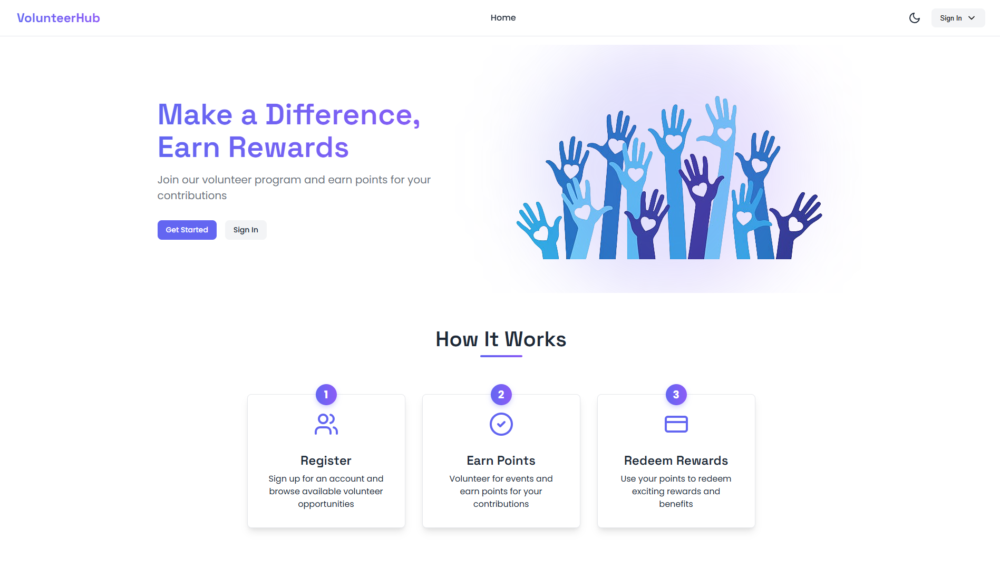
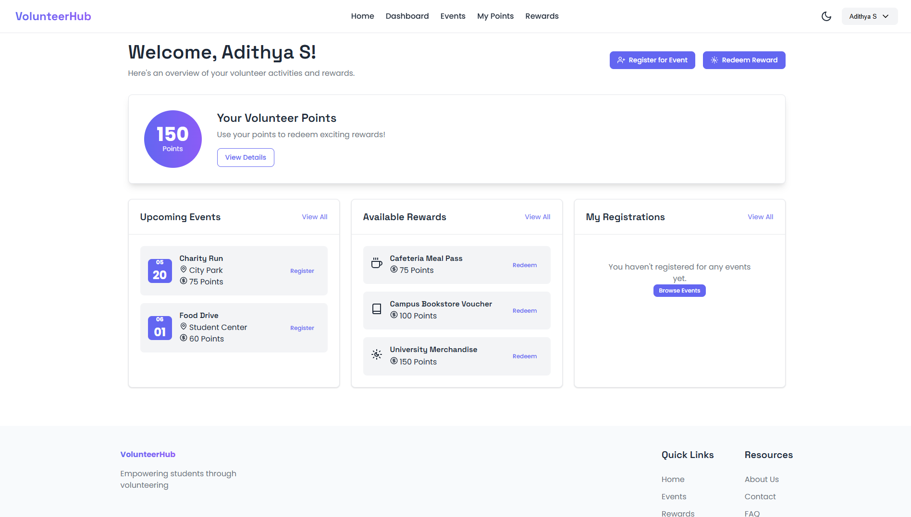

# VolunteerHub - Volunteer Management System

VolunteerHub is a comprehensive web application designed to facilitate volunteer management for organizations. It enables students to register for volunteer events, earn points for their participation, and redeem those points for various rewards.

## Features

### For Students
- **Account Management**: Create and manage personal accounts
- **Event Registration**: Browse and register for upcoming volunteer events
- **Points System**: Earn points by completing volunteer activities
- **Rewards Redemption**: Exchange earned points for various rewards
- **Activity Tracking**: Monitor personal volunteer history and points balance

### For Administrators
- **Student Management**: Add, edit, and view student information
- **Event Management**: Create and organize volunteer events
- **Volunteer Coordination**: Assign roles to volunteers and mark completions
- **Points Administration**: Manually adjust points and view points history
- **Rewards Management**: Create and manage redeemable rewards

## Tech Stack

- **Backend**: Python with Flask framework
- **Database**: SQLite
- **Frontend**: HTML, CSS, JavaScript
- **Authentication**: Custom session-based authentication

## Installation

1. Clone the repository:
   ```
   git clone https://github.com/DevAdy/CollegeEventVolunteeringPortal.git
   cd DBMS_Mini_project_Ft
   ```

2. Set up a virtual environment:
   ```
   python -m venv venv
   source venv/bin/activate  # On Windows, use: venv\Scripts\activate
   ```

3. Install dependencies:
   ```
   pip install -r requirements.txt
   ```

4. Run the application:
   ```
   python app.py
   ```

5. Access the application in your browser at `http://127.0.0.1:5000`

## Database Schema

The application uses an SQLite database with the following tables:
- **students**: User account information
- **events**: Volunteer event details
- **registrations**: Tracks student registrations for events
- **points**: Manages student point balances
- **rewards**: Available rewards for point redemption
- **redemptions**: Records of reward redemptions
- **points_adjustments**: History of manual point adjustments

## Usage

### Admin Login
- Email: admin@volunteerhub.com
- Password: admin123

### Student Features
1. Register for an account
2. Browse available volunteer events
3. Register for events
4. View earned points
5. Redeem points for rewards

### Admin Features
1. Add and manage students
2. Create and manage events
3. Assign volunteer roles
4. Mark volunteer activities as completed
5. Adjust student points manually
6. Add and manage rewards

## Screenshots

### User Interface
<div align="center">
  <h4>Home Page</h4>
  
  <br><br>
  
  <h4>Login & Registration</h4>
  <div>
 
 
  </div>
  <br><br>
</div>

### Student Interface
<div align="center">
  <h4>Student Dashboard</h4>
  
  <br><br>
  
  <h4>Event Registration & Points</h4>
  <div>
 
 
  </div>
  <br><br>
  
  <h4>Rewards System</h4>
  <div>
 
 
  </div>
  <br><br>
</div>

### Admin Interface
<div align="center">
  <h4>Admin Dashboard</h4>
  
  <br><br>
  
  <h4>Student & Event Management</h4>
  <div>
 
 
  </div>
  <br><br>
  
  <h4>Rewards Management</h4>
  
  <br><br>
</div> 

## Contributing

1. Fork the repository
2. Create your feature branch (`git checkout -b feature/amazing-feature`)
3. Commit your changes (`git commit -m 'Add some amazing feature'`)
4. Push to the branch (`git push origin feature/amazing-feature`)
5. Open a Pull Request

## License

This project is licensed under the MIT License - see the LICENSE file for details.

## Acknowledgments

- [Flask Documentation](https://flask.palletsprojects.com/)
- [SQLite Documentation](https://www.sqlite.org/docs.html)

## Authors

<table>
  <tr>
    <td align="center">
      <a href="https://github.com/DevAdy">
        <br>
        <sub><b>Aditya B</b></sub>
      </a>
    </td>
    <td align="center">
      <a href="https://github.com/knighthyper">
        <br>
        <sub><b>Adithya S</b></sub>
      </a>
    </td>
  </tr>
</table>